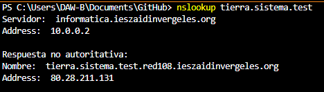
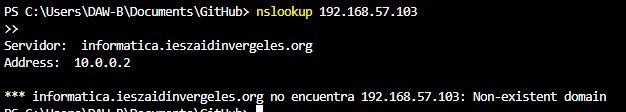
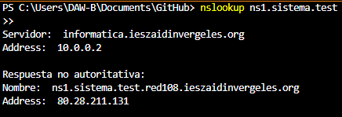
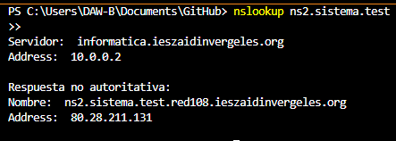
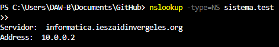

Comprueba con dig o nslookup que:

• Puedes resolver los registros tipo A.

• Comprueba que se pueden resolver de forma inversa sus direcciones IP.

• Puedes resolver los alias ns1.sistema.test y ns2.sistema.test.

• Realiza la consulta para saber los servidores NS de sistema.test. Debes obtener
tierra.sistema.test y venus.sistema.test.

• Realiza la consulta para saber los servidores MX de sistema.test.

• Comprueba que se ha realizado la transferencia de la zona entre el servidor DNS maestro y el
esclavo. Revisa los logs o realiza una consulta del registro AXFR.

• Comprueba que tanto maestro como esclavo pueden contestar a las mismas preguntas.